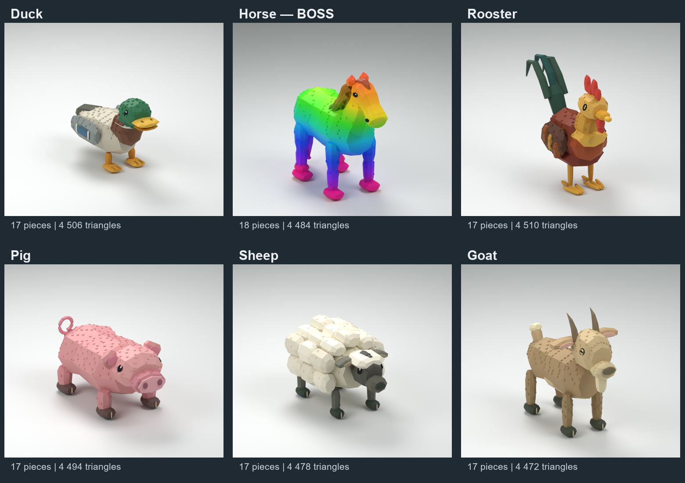

# Monde 1 — ferme, animaux en maillage

Six animaux, dans l'ordre demandé : **Duck, Horse (boss), Rooster, Pig, Sheep, Goat**. Chaque sous-dossier porte exactement le nom de l'animal et contient son FBX, sa texture, son rig d'assemblage et deux rendus du vrai modèle. Les œufs de la ferme ne sont pas modifiés.

## Contrat du jeu conservé

Le modèle assemblé garde son nom `Duck`, `Horse`, `Rooster`, `Pig`, `Sheep` ou `Goat`, une racine `RigRoot`, les mêmes noms et relations `Motor6D` que l'ancien animal, et `Animations/Idle`, `Walk`, `Attack` en `KeyframeSequence`. Les poses, durées, boucles et repères `Impact` sont conservés. Le cheval garde son attaque cabrée et le dégradé arc-en-ciel.

Les yeux sont symétriques, noirs et plaqués sur la surface du crâne ; la chèvre a une pupille noire horizontale. Les petits détails séparés utilisent des `Weld` vers leur membre existant : ils le suivent exactement et n'ajoutent pas de nouvelle piste d'animation. Le lecteur actuel accepte déjà ces attaches ; aucun lecteur ou script du jeu n'est modifié.

Le corps du cheval est élargi, le poitrail renforcé, les pattes épaissies, l'encolure arquée. Une vraie crinière épaisse, continue et en mèches descend de la nuque au garrot ; elle est intégrée au maillage `Neck` et suit son articulation sans nouvelle pièce. Ses teintes arc-en-ciel sont plus profondes pour la distinguer du cou. Son visage a un chanfrein continu, un museau large et arrondi, des naseaux plaqués et un toupet raccordé au front : les anciens blocs de museau et bandes du front sont retirés. Le cheval conserve sa longue queue. Les oreilles, queues et reliefs sont raccordés à leur anatomie. `Horse/Horse-visage.png` montre le gros plan du vrai maillage.

## Importer chaque animal

1. Importer son **`Duck.fbx`** (ou `Horse.fbx`, etc.) avec Import 3D. Garder tous les objets et leurs noms : **Merge Meshes désactivé**, **No Rig**, unité **Studs**, axes **Front / Top**. Utiliser le propriétaire/groupe du jeu. [Documentation de l'importeur](https://create.roblox.com/docs/studio/importer).
2. Insérer le fichier `Duck-rig-template.rbxmx` correspondant.
3. Sélectionner les deux modèles dans Explorer, puis exécuter `Assembler-Duck.luau` dans la Command Bar, en mode édition. Il crée un nouveau `Duck`, sans supprimer les deux originaux.
4. Contrôler les trois clips avec le lecteur actuel, puis enregistrer le modèle assemblé en `.rbxm` et remplacer l'ancien animal seulement après ce contrôle.

**Le gabarit `.rbxmx` seul est transparent : il contient le squelette Motor6D et les clips, pas les MeshParts publiés sur Roblox.** L'import du FBX attribue les identifiants de maillage et texture ; l'assembleur raccorde ces vrais MeshParts au rig. Ne pas mettre le gabarit seul à la place de l'ancien animal. Le FBX est rigide, sans Bones, pour éviter d'imposer un autre lecteur.

Chaque animal a **17 pièces au total, sauf Horse : 18**, racine invisible incluse. Le décompte exact des triangles figure dans `MANIFEST.json` et `FBX-VALIDATION.json` de chaque animal ; il reste entre 4 000 et 6 000. Le mouton n'est pas plus lourd que le budget prévu.

## Vérifications

`NATIVE-VALIDATION.json` contrôle la structure et les poses des maillages avec les attaches. `FBX-VALIDATION.json` contrôle une réimportation du FBX : nombre de maillages, absence de Bones, UV, texture et dimensions. `CONTACT-VALIDATION.json` contrôle les contacts au repos et les paires gauche/droite sur le FBX réel. `checks/check-native-mesh.ps1` vérifie aussi XML, références, noms de clips et syntaxe Luau.

**L'import et l'exécution dans Roblox Studio restent à vérifier.** Seules les dimensions générées de `Horse` dans `MeshRigs.luau` sont synchronisées avec le FBX retouché ; le lecteur et les règles du jeu, sa configuration, les anciens modèles et les œufs restent inchangés. Aucun crédit Meshy n'a été consommé.
