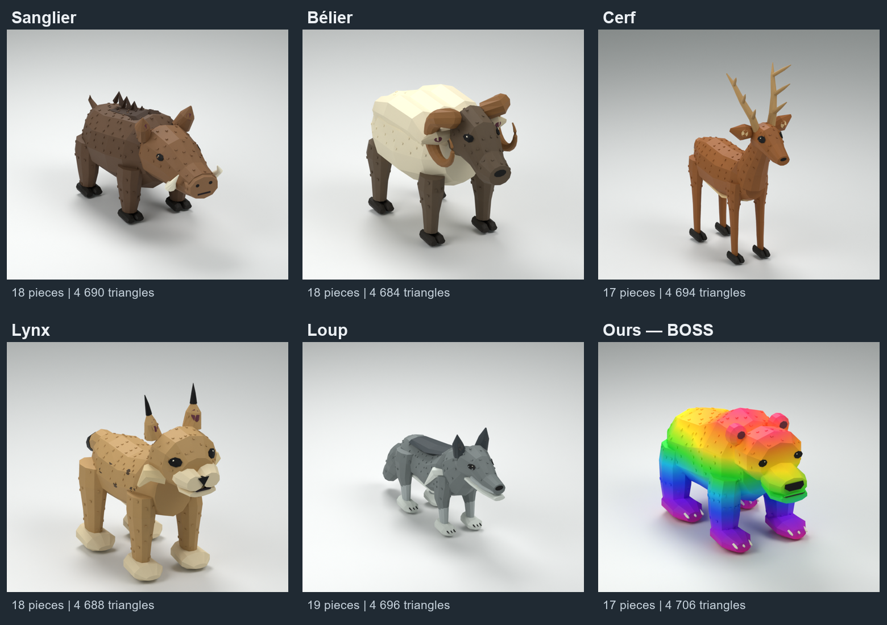

# Monde 2 — forêt, animaux en maillage

La collection en maillage est complète. Le boss **Bear**, ses fichiers et les œufs restent inchangés ; les cinq autres animaux gardent exactement les noms, le graphe Motor6D et les clips des modèles actifs de `assets/combat/animaux/salle-4/models/`.

| Animal | Pièces avec RigRoot | Triangles | Motor6D | Identité visuelle |
| --- | ---: | ---: | ---: | --- |
| Boar | 18 | 4 690 | 9 | Sanglier massif, long groin, défenses ivoire, crête sombre |
| Ram | 18 | 4 684 | 9 | Bélier laineux, face brune, cornes enroulées |
| Deer | 17 | 4 694 | 14 | Cerf élancé, pattes fines à sabots, grands bois ramifiés |
| Lynx | 18 | 4 688 | 10 | Plumets noirs, favoris clairs, taches et queue courte noire |
| Wolf | 19 | 4 696 | 17 | Loup gris, museau long, oreilles pointues, queue touffue |
| Bear — boss | 17 | 4 706 | 10 | Ours massif, dégradé arc-en-ciel conservé |

Tous ont `Animations/Idle`, `Walk`, `Attack` en `KeyframeSequence`. Les clips `Bite` existants de Lynx, Wolf et Bear sont conservés ; Boar, Ram et Deer n'en avaient pas. Les pièces décoratives suivent leur membre par Weld, sans nouveau canal d'animation. Les yeux noirs sont ajustés à la surface du crâne ; ceux du loup sont fusionnés au maillage Head pour garder le budget sous 20 pièces. Les oreilles, queues, cornes et bois sont raccordés à leur anatomie.

## Ours boss préservé

Ours massif avec bosse d'épaules intégrée au dos, tête large, oreilles rondes raccordées au crâne, museau arrondi, grandes pattes et griffes. Le dégradé arc-en-ciel du boss reste visible. Yeux noirs, symétriques et ajustés sur la surface réelle de la tête.

**17 pièces, racine comprise ; 4 706 triangles ; 10 Motor6D d'origine.** Six décorations liées par Weld — les deux yeux et les quatre pieds — suivent exactement leur membre existant. Les clips `Animations/Idle`, `Walk`, `Attack`, `Bite`, en `KeyframeSequence`, sont conservés avec leurs poses, durées et repères Impact. Le modèle s'appelle toujours `Bear`, avec `RigRoot` comme racine. Aucun lecteur d'animations n'est changé.

## Importer

1. Importer **`Bear/Bear.fbx`** dans Studio avec Import 3D, sans fusionner les maillages et sans générer de rig à Bones. Garder les noms `Import3D_*` et la texture `Bear_Colour_512.png`.
2. Mettre l'import dans `ReplicatedStorage.MeshImports` et l'enregistrer avec le workflow existant. Le nouveau template est monté dans `ReplicatedStorage.MeshRigs.Bear` et ses dimensions sont ajoutées à `src/shared/MeshRigs.luau` : le lecteur actuel peut l'assembler automatiquement. L'ancien visuel reste le secours tant que le FBX n'est pas importé.
3. Pour un assemblage manuel, insérer `Bear-rig-template.rbxmx`, sélectionner l'import et le template, puis exécuter `Assembler-Bear.luau` en mode édition. Les deux originaux sont conservés. Le template seul est transparent, il n'est pas un modèle visuel complet.
4. Vérifier les quatre clips en jeu avant de remplacer l'ancien visuel. Les fichiers faciles à importer sont aussi dans `../A-IMPORTER/`.

Pour Boar, Ram, Deer, Lynx et Wolf, suivre la même procédure avec leur FBX, texture, template et `Assembler-<animal>.luau`. Chaque sous-dossier contient aussi le fichier `.blend` retouchable, les rendus de face/profil et les rapports de validation. Les cinq nouveaux templates et leurs dimensions sont raccordés à `MeshRigs`, sans modifier le lecteur ni les visuels de secours. Les FBX n'ont pas de Bones : le lecteur utilise les Motor6D et clips locaux existants.

## Contrôles

Réimportation du FBX, UV et texture, dimensions, budget, références XML, noms d'articulations et clips, syntaxe Luau, suivi des vertices dans les poses échantillonnées, contacts des membres au repos et symétrie gauche/droite vérifiés. Les rapports détaillés accompagnent le modèle. `checks/check-native-mesh.ps1` peut être relancé sur le dossier `Bear`.

**Import et exécution dans Studio non testés ici.** Aucun identifiant Roblox n'est inventé ; le FBX nécessite votre publication/import. Aucun crédit Meshy n'a été consommé.
