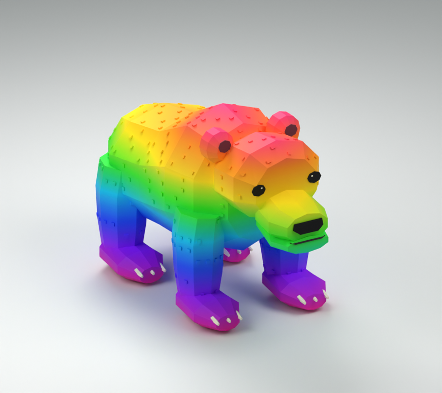

# Monde 2 — forêt : Bear en maillage

Premier lot de la migration demandée : le boss **Bear**. Les cinq autres animaux de la forêt sont prévus après la jungle ; leurs assets restent inchangés pour l'instant. Les œufs ne sont pas refaits.

Ours massif avec bosse d'épaules intégrée au dos, tête large, oreilles rondes raccordées au crâne, museau arrondi, grandes pattes et griffes. Le dégradé arc-en-ciel du boss reste visible. Yeux noirs, symétriques et ajustés sur la surface réelle de la tête.

**17 pièces, racine comprise ; 4 706 triangles ; 10 Motor6D d'origine.** Six décorations liées par Weld — les deux yeux et les quatre pieds — suivent exactement leur membre existant. Les clips `Animations/Idle`, `Walk`, `Attack`, `Bite`, en `KeyframeSequence`, sont conservés avec leurs poses, durées et repères Impact. Le modèle s'appelle toujours `Bear`, avec `RigRoot` comme racine. Aucun lecteur d'animations n'est changé.

## Importer

1. Importer **`Bear/Bear.fbx`** dans Studio avec Import 3D, sans fusionner les maillages et sans générer de rig à Bones. Garder les noms `Import3D_*` et la texture `Bear_Colour_512.png`.
2. Mettre l'import dans `ReplicatedStorage.MeshImports` et l'enregistrer avec le workflow existant. Le nouveau template est monté dans `ReplicatedStorage.MeshRigs.Bear` et ses dimensions sont ajoutées à `src/shared/MeshRigs.luau` : le lecteur actuel peut l'assembler automatiquement. L'ancien visuel reste le secours tant que le FBX n'est pas importé.
3. Pour un assemblage manuel, insérer `Bear-rig-template.rbxmx`, sélectionner l'import et le template, puis exécuter `Assembler-Bear.luau` en mode édition. Les deux originaux sont conservés. Le template seul est transparent, il n'est pas un modèle visuel complet.
4. Vérifier les quatre clips en jeu avant de remplacer l'ancien visuel. Les fichiers faciles à importer sont aussi dans `../A-IMPORTER/`.

## Contrôles

Réimportation du FBX, UV et texture, dimensions, budget, références XML, noms d'articulations et clips, syntaxe Luau, suivi des vertices dans les poses échantillonnées, contacts des membres au repos et symétrie gauche/droite vérifiés. Les rapports détaillés accompagnent le modèle. `checks/check-native-mesh.ps1` peut être relancé sur le dossier `Bear`.

**Import et exécution dans Studio non testés ici.** Aucun identifiant Roblox n'est inventé ; le FBX nécessite votre publication/import. Aucun crédit Meshy n'a été consommé.
