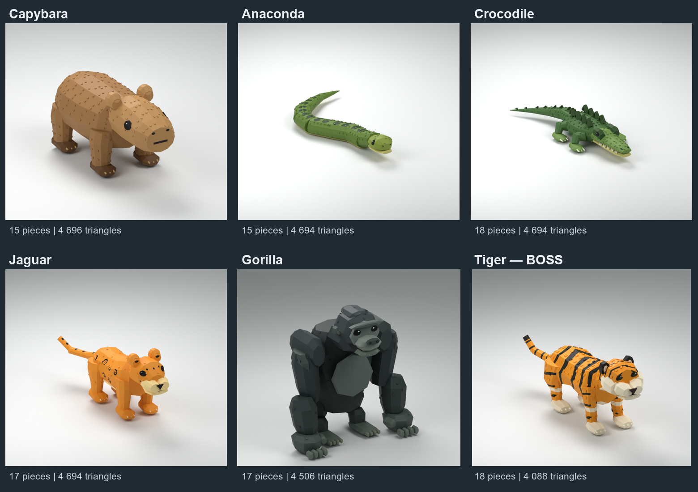

# Monde 3 — jungle, animaux en maillage

- **Capybara** : corps trapu, tête émoussée et petites oreilles ; 15 pièces, 4 696 triangles, 8 `Motor6D`.
- **Anaconda** : silhouette en S, ventre clair et motifs sombres ; 15 pièces, 4 694 triangles, 11 `Motor6D`.
- **Crocodile** : museau plat, mâchoire mobile, pattes écartées et dos cuirassé ; 18 pièces, 4 694 triangles, 11 `Motor6D`.
- **Jaguar** : pelage doré naturel à rosettes noires, sans arc-en-ciel ni aura d'ultra-rare ; 17 pièces, 4 694 triangles, 12 `Motor6D`. **Le boss de la jungle est Tiger, pas Jaguar.**
- **Tiger** : boss orange à rayures, 17 maillages et `RigRoot`, 17 `Motor6D`, clips `Idle`, `Walk`, `Attack`, `Bite`. Oreilles raccordées au crâne, yeux noirs symétriques.
- **Gorilla** : 16 maillages et `RigRoot`, 16 `Motor6D`, clips `Idle`, `Walk`, `Attack`. Corps massif, longs bras, mains à doigts et dos argenté.
- **TigerEgg** et **GorillaEgg** : œufs natifs sans nid ni scripts, thème de leur animal. Aucune rareté attribuée et aucun œuf existant remplacé.

Les quatre nouveaux animaux gardent exactement le graphe et les clips des modèles actifs de `assets/combat/animaux/salle-5/models/`. Tous ont `Idle`, `Walk`, `Attack` ; `Bite` est conservé pour Anaconda, Crocodile et Jaguar. Le capybara n'avait pas de clip `Bite` et n'en reçoit pas de nouveau. Les pièces décoratives sont soudées à leur membre animé ; yeux noirs symétriques, oreilles et queues raccordées. Tiger, Gorilla et tous les œufs sont inchangés dans ce lot.

## Import et assemblage

Dans le sous-dossier de l'animal, importer son FBX (`Capybara.fbx`, `Anaconda.fbx`, `Crocodile.fbx`, `Jaguar.fbx`, `Tiger.fbx` ou `Gorilla.fbx`) avec **Merge Meshes désactivé**, **No Rig**, unité **Studs**, axes **Front / Top**, sous le propriétaire/groupe du jeu. Les quatre nouveaux FBX et leurs textures sont aussi dans `../A-IMPORTER/`. [Documentation de l'importeur](https://create.roblox.com/docs/studio/importer).

Insérer le `*-rig-template.rbxmx` correspondant, sélectionner le modèle FBX et le gabarit, puis exécuter `Assembler-<animal>.luau` dans la Command Bar de Studio en édition. Le résultat garde les noms, `RigRoot`, les articulations et `KeyframeSequence` attendus par le lecteur actuel. Aucun changement de lecteur nécessaire.

**Le gabarit transparent n'est pas un modèle visuel autonome.** Importer le FBX pour obtenir les identifiants Roblox des MeshParts/textures, puis assembler. Contrôler les animations et enregistrer le modèle final avant de remplacer l'ancien. Les deux originaux sélectionnés sont conservés.

Les œufs `.rbxmx` s'insèrent directement. Les FBX des animaux n'ont pas de Bones ; leur animation est assurée par la structure Motor6D et les clips locaux livrés.

Les nombres précis de triangles, pièces et articulations figurent dans les manifestes et rapports de contrôle de chaque animal. Vérifications locales de géométrie, réimport FBX, XML, syntaxe et poses réalisées ; **import/exécution dans Studio et mobile non testés**. Les templates et dimensions des quatre nouveaux animaux sont raccordés au système `MeshRigs` existant ; les visuels de secours, le lecteur, les règles du jeu et les œufs sont conservés. Aucun crédit Meshy utilisé. Les fichiers `.blend` permettent de retoucher les géométries.
