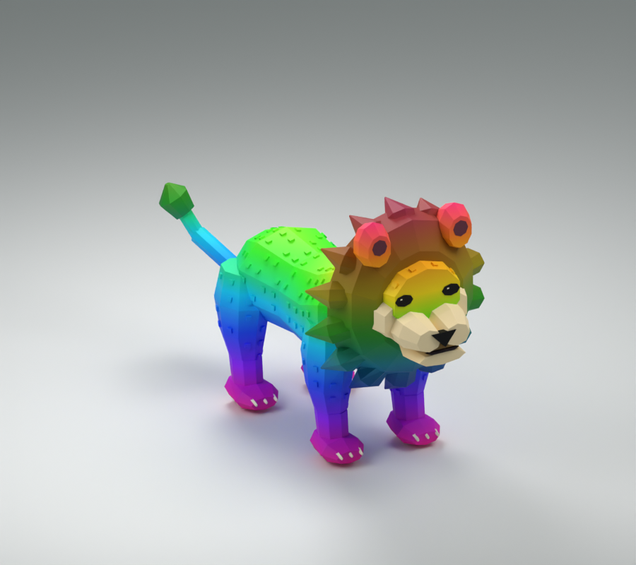

# Monde 4 — savane : Lion en maillage

Premier lot de la migration demandée : le boss **Lion**. Hyena, Buffalo, Cheetah, Rhino et Elephant restent inchangés ; leur migration vient après la jungle et la forêt. Les œufs ne sont pas refaits.

Lion au poitrail large, crinière continue et mèches effilées raccordées à sa tête, museau félin en deux lobes, joues claires, yeux noirs et longue queue articulée terminée par un toupet. Le dégradé arc-en-ciel du boss est gardé, avec une crinière aux teintes plus profondes.

**19 pièces, racine comprise ; 4 744 triangles ; les 17 Motor6D d'origine.** Les détails du visage et la crinière sont intégrés au membre `Head`, sans pièces flottantes ajoutées. Le toupet `TailTuft` d'origine suit `Tail2` par un Weld ; sa présence distingue cet import du tigre, dont les articulations ont les mêmes noms. Les clips `Animations/Idle`, `Walk`, `Attack`, `Bite`, en `KeyframeSequence`, sont conservés avec leurs poses, durées et repères Impact. Le modèle s'appelle toujours `Lion`, avec `RigRoot` comme racine. Aucun lecteur d'animations n'est changé.

## Importer

1. Importer **`Lion/Lion.fbx`** dans Studio avec Import 3D, sans fusionner les maillages et sans générer de rig à Bones. Garder les noms `Import3D_*` et la texture `Lion_Colour_512.png`.
2. Mettre l'import dans `ReplicatedStorage.MeshImports` et l'enregistrer avec le workflow existant. Le nouveau template est monté dans `ReplicatedStorage.MeshRigs.Lion` et ses dimensions sont ajoutées à `src/shared/MeshRigs.luau` : le lecteur actuel peut l'assembler automatiquement. L'ancien visuel reste le secours tant que le FBX n'est pas importé.
3. Pour un assemblage manuel, insérer `Lion-rig-template.rbxmx`, sélectionner l'import et le template, puis exécuter `Assembler-Lion.luau` en mode édition. Les deux originaux sont conservés. Le template seul est transparent, il n'est pas un modèle visuel complet.
4. Vérifier les quatre clips en jeu avant de remplacer l'ancien visuel. Les fichiers faciles à importer sont aussi dans `../A-IMPORTER/`.

## Contrôles

Réimportation du FBX, UV et texture, dimensions, budget, références XML, noms d'articulations et clips, syntaxe Luau, suivi des vertices dans les poses échantillonnées, contacts des membres au repos et symétrie des oreilles et pattes vérifiés. Les rapports détaillés accompagnent le modèle. `checks/check-native-mesh.ps1` peut être relancé sur le dossier `Lion`.

**Import et exécution dans Studio non testés ici.** Aucun identifiant Roblox n'est inventé ; le FBX nécessite votre publication/import. Aucun crédit Meshy n'a été consommé.
