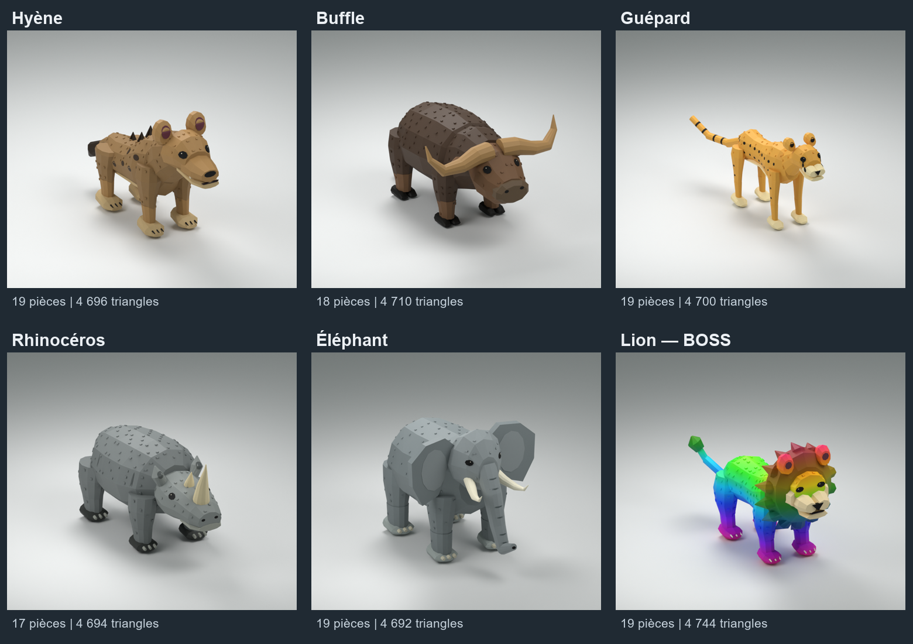

# Monde 4 — savane en maillages

Dernier lot de la migration : **Hyena, Buffalo, Cheetah, Rhino et Elephant**, dans le style facetté du tigre. Le **Lion boss arc-en-ciel déjà livré est conservé à l'identique**, et les œufs ne sont pas refaits.

- **Hyena** : épaules hautes, dos descendant, museau puissant, oreilles arrondies, petites taches et crête sombre.
- **Buffalo** : corps massif, tête large, cornes balayées sur les côtés et sabots fendus.
- **Cheetah** : silhouette fine, longues pattes, taches pleines, marques noires sous les yeux et longue queue annelée ; pas les rosettes du jaguar.
- **Rhino** : corps lourd, tête allongée, deux cornes, plis de peau discrets et pieds à trois ongles.
- **Elephant** : larges oreilles plates raccordées à la tête, défenses, trompe articulée en quatre membres et pieds à ongles.
- **Lion** : boss au dégradé arc-en-ciel, vraie crinière raccordée et longue queue. Son dossier et ses fichiers n'ont pas changé.

Les cinq nouveaux animaux restent sous **20 pièces, racine comprise**, avec environ **4 700 triangles** chacun. Les yeux sont noirs et les détails raccordés aux membres ; les paires d'oreilles, de pattes et les yeux séparés sont symétriques. Les défenses, cornes et détails sont intégrés au membre auquel ils appartiennent, sans objets physiques supplémentaires.

## Structure compatible avec le jeu

Chaque modèle garde son nom anglais, la racine `RigRoot`, exactement les noms et relations Motor6D d'origine, ainsi que le dossier `Animations` avec ses `KeyframeSequence`.

Tous conservent `Idle`, `Walk` et `Attack`. **Hyena et Cheetah conservent aussi leur clip `Bite` existant** ; les trois autres n'en avaient pas. Les poses, durées, boucles et repères des clips restent inchangés. Aucun lecteur d'animations, aucune règle de combat ou probabilité n'est changé.

Le guépard garde le nom décoratif d'origine `TailRingTail20`, relié à `Tail2` par un Weld, pour distinguer son import des autres félins partageant les mêmes noms d'articulations. Les yeux séparés de Hyena, Buffalo et Rhino suivent `Head` par des Welds ; ceux de Cheetah et Elephant sont directement intégrés à la tête.

## Fichiers et import Studio

Chaque dossier contient **`Animal.fbx`**, sa texture `Animal_Colour_512.png`, le template `Animal-rig-template.rbxmx`, `Assembler-Animal.luau`, un `.blend` retouchable, trois rendus et les rapports de validation. Les FBX et textures sont aussi regroupés dans [A-IMPORTER](../A-IMPORTER/).

1. Importer le FBX avec **Import 3D**, sans fusionner les maillages et sans générer de rig à Bones. Garder les noms `Import3D_*` et la texture associée. Ces FBX sont des maillages rigides destinés aux Motor6D existants, pas des rigs à os.
2. Placer l'import publié dans `ReplicatedStorage.MeshImports` et l'enregistrer avec le workflow existant. Les cinq templates et leurs dimensions sont raccordés à `MeshRigs` ; le lecteur existant peut les assembler. Les imports déjà livrés, notamment `imports/Lot2.rbxm`, sont conservés.
3. Pour un assemblage manuel en mode édition, insérer le template, sélectionner l'import et le template, puis exécuter `Assembler-Animal.luau`. Les deux originaux sont conservés. **Le template seul est transparent : il ne remplace pas le FBX.**
4. Vérifier les clips en jeu et sur téléphone avant de retirer les anciens visuels de secours.

## Contrôles

Réimportation des FBX, UV/texture, nombre réel de maillages et de triangles, dimensions, références XML, syntaxe Luau, conservation des articulations et des clips, suivi des vertices dans les poses échantillonnées, contacts au repos et symétrie contrôlés. La comparaison des `KeyframeSequence` avec les anciens RBXMX est également vérifiée, hors identifiants internes XML.

Les rapports `NATIVE-VALIDATION.json`, `FBX-VALIDATION.json` et `CONTACT-VALIDATION.json` sont dans chaque dossier. Relancer `checks/check-native-mesh.ps1 -AssetDirectory CHEMIN_ANIMAL` pour vérifier le rig ; les vérifications FBX et contacts utilisent les scripts Blender dans `checks/`.

**Les nouveaux FBX ne sont pas encore importés ni testés dans Roblox Studio ici.** Aucun identifiant de maillage Roblox n'est inventé. Aucun crédit Meshy n'a été consommé : fabrication et contrôles locaux. Les œufs et le Lion boss restent inchangés.
