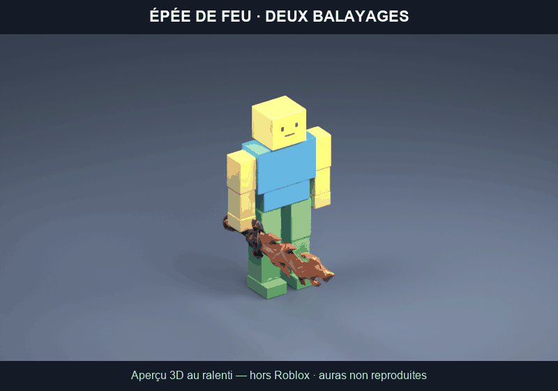

# MONDE — auras élémentaires et deux balayages (v4)

Déjà branchés dans le jeu habituel : `src/client/CombatMotion.luau` et
`src/client/SwordEffects.luau`, qui charge `SwordElementalAura.luau`.
Les anciens dossiers de personnages sont des archives, pas des modules à recopier.

- Deux balayages alternés de 204°, avec pieds décalés, bassin qui entraîne le
  buste, bras qui s'étend pendant le coup et poignet qui couche le tranchant.
- Manche toujours placé par `SwordGrip` sur la prise de la main. Les deux traces
  existantes suivent `TrailBase` et `TrailTip`, pas un cercle indépendant.
- Feu : halo orangé, cœur clair, flammes et braises montantes.
- Glace : halo cyan, brume froide et scintillements blancs.
- Foudre : halo doré, éclairs jaunes ramifiés avec cœur blanc. Jamais bleue.
- Particules et lumière réduites sur mobile, effets coupés à distance, quotas
  d'auras et nettoyage à la destruction ou après une téléportation.

Les modèles, leur grossissement actuel, la posture de garde, le stand et l'ordre
fer → acier → or → glace → feu → foudre de Claude sont conservés. Pas de changement
aux dégâts, à la portée, au délai serveur, aux prix ou aux sauvegardes dans ce
correctif. Durée visuelle inchangée : 0,38 s. Aucun crédit Meshy utilisé.

## Vérifications et essai

Depuis `roblox-monde`, lancer `tools/combat-v4/check.ps1` : syntaxe de tous les
modules, 89 contrôles de timing/alternance, deux exports R15 avec un seul marqueur
Impact chacun, construction du jeu et de l'aperçu dans un dossier temporaire.

La scène indépendante `gallery.project.json` utilise les vrais `SwordMeshes`
et les modules actifs. Lancer Play dans Studio : elle alterne une présentation
glace/feu/foudre puis les deux coups sur un mannequin. Elle affiche les erreurs
et les assets non chargés. Elle ne publie rien et ne touche pas aux sauvegardes.

**Exécution et rendu dans Roblox Studio / sur téléphone non vérifiés.** Les
contrôles hors moteur ne remplacent pas ce test. Le GIF fourni est un aperçu 3D
du geste avec l'épée de feu, pas une capture Roblox ; les nouvelles particules
et auras n'y sont pas reproduites. Les derniers changements de Claude (épées
agrandies et garde au repos) sont conservés dans le jeu. La galerie prend la
taille actuelle des épées, mais son mannequin garde sa pose Idle de test.
Ces changements ne figurent pas dans le GIF antérieur.

Textures internes Roblox (`rbxasset://textures/...`) : pas de nouvelle image à
importer. Les halos emploient plusieurs segments pour conserver leurs courbes
de transparence ; référence : [Beam](https://create.roblox.com/docs/reference/engine/classes/Beam).
